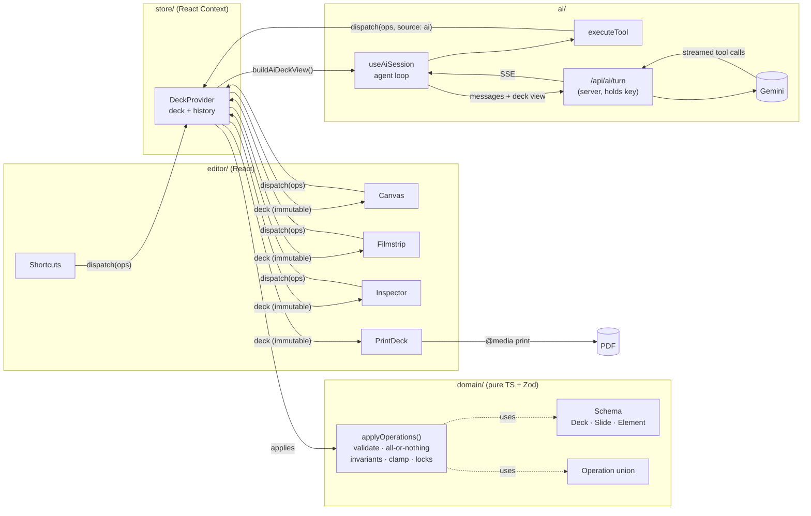

# AI Presentation Builder

Generate a slide deck from a prompt, refine it through chat, and edit it on a free-form canvas: drag, resize, restyle and move elements between slides. Manual and AI edits share one deck, so neither overwrites the other.

**Core loop:** prompt → AI plans and fills slides (streamed) → review → ask the AI to refine _or_ edit, drag and rearrange by hand → repeat → export to PDF.

**Stack:** Next.js 16 (App Router) · React 19 · TypeScript (strict) · Zod 4 · @dnd-kit · Recharts · Gemini (via Google's OpenAI-compatible endpoint) · Vitest

---

## Contents

1. [Setup](#setup)
2. [Generation time (please read before testing)](#generation-time-please-read-before-testing)
3. [Features](#features)
4. [Architecture overview](#architecture-overview)
5. [Code architecture](#code-architecture)
6. [Drag and drop and cross-slide moves](#drag-and-drop-and-cross-slide-moves)
7. [AI agent](#ai-agent)
8. [Export](#export)
9. [Testing](#testing)
10. [Known issues and incomplete features](#known-issues-and-incomplete-features)

---

## Setup

**Requirements:** Node.js 20.9 or newer (22 recommended, see `.nvmrc`) and a Gemini API key from [Google AI Studio](https://aistudio.google.com/api-keys).

```bash
git clone https://github.com/thesdtiwari/LLMpoweredPPTs.git
cd LLMpoweredPPTs
npm install
cp .env.example .env.local      # then set GEMINI_API_KEY in .env.local
npm run dev                     # http://localhost:3000
```

Check the configuration at http://localhost:3000/api/health. It should report `"aiConfigured": true`; the key itself is never returned.

The editor also works without a key: click **Start from a sample deck** on the empty canvas. Only the chat needs the key.

### Environment variables

| Variable                 | Required    | Default                                                                                           | Notes                                                                                                                                              |
| ------------------------ | ----------- | ------------------------------------------------------------------------------------------------- | -------------------------------------------------------------------------------------------------------------------------------------------------- |
| `GEMINI_API_KEY`         | For AI chat | –                                                                                                 | **Server-only.** Read in `src/server/env.ts`, which is `server-only`, so it can't be bundled for the browser. Never prefix it with `NEXT_PUBLIC_`. |
| `GEMINI_MODEL`           | No          | `gemini-3.6-flash`                                                                                | Primary model.                                                                                                                                     |
| `GEMINI_FALLBACK_MODELS` | No          | `gemini-3.7-flash,gemini-3.8-flash,gemini-3.5-flash,gemini-3-flash-preview,gemini-3.1-flash-lite` | Tried in order when the primary returns 429 (quota) or 503 (overloaded).                                                                           |

`.env` and `.env*.local` are git-ignored.

### Scripts

| Command                       | What it does                                           |
| ----------------------------- | ------------------------------------------------------ |
| `npm run dev`                 | Development server with hot reload                     |
| `npm run build` / `npm start` | Production build / serve it                            |
| `npm run check`               | Type check + lint + unit tests (the same checks as CI) |
| `npm run typecheck`           | `tsc --noEmit` in strict mode                          |
| `npm run lint`                | ESLint, including the architecture import rules below  |
| `npm test`                    | Vitest unit tests                                      |
| `npm run format`              | Prettier                                               |

### Deploying (Vercel)

1. Import the GitHub repo in Vercel. The framework preset is Next.js, and no extra configuration is needed.
2. Add `GEMINI_API_KEY` under **Project Settings → Environment Variables**.
3. Deploy, then open `https://<your-app>/api/health` and check it shows `"aiConfigured": true`.

CI (`.github/workflows/ci.yml`) runs the type check, lint, unit tests and a production build on every push and pull request.

---

## Generation time (please read before testing)

AI generation runs on **Gemini's free tier**, which is slow and rate-limited. Please allow time before concluding something is stuck.

| What you ask for                          | Typical time  | Measured range |
| ----------------------------------------- | ------------- | -------------- |
| Create a 5–7 slide deck                   | 1–2 minutes   | 25 s – 5 min   |
| Edit one slide / add a chart / move items | 10–30 seconds | 5 s – 1 min    |
| Question about the deck ("which slide…")  | 5–15 seconds  | 5 s – 30 s     |

**What you'll see while it works**

- Planning takes about 5–20 seconds; then all slides appear in the filmstrip as **"Generating…"** placeholders.
- Slides fill in one or two at a time. Each completed tool call shows a ✓ chip in the chat.
- **"Thinking…"** with no new chips for a minute or more is normal on the free tier. The model is reasoning, and the server sends a keep-alive signal every 15 seconds so the connection stays open.
- If the model returns a malformed or cut-off step, the chat shows **"retrying…"** and continues automatically (up to 4 times). Planned slides the model leaves empty are filled automatically too.
- If every Gemini model is busy or out of quota, the chat says so. Wait about a minute and send the request again.

**Why it's slow, and the limits involved**

- Gemini 3 "Flash" models think before answering. One step in our tests took up to about 3.5 minutes on the free tier.
- A deck generation is about 4–6 requests: 1 plan, fills in batches of up to 2 slides, then a short summary.
- Each request is a separate server call, limited to **300 seconds** (`maxDuration` in `src/app/api/ai/turn/route.ts`, the Vercel Hobby maximum). A whole generation can therefore run longer than 5 minutes; only a single step is capped.
- The free tier allows about **20 requests per model** per quota window. When one model is exhausted or overloaded (429 / 503), the app falls back through the other Gemini models listed in `GEMINI_FALLBACK_MODELS`.

**To make it fast:** enable billing on the Google Cloud project behind `GEMINI_API_KEY` (a paid tier gives higher quotas and faster, less congested responses). No code changes are needed. You can also set `GEMINI_MODEL` to a lighter model such as `gemini-3.1-flash-lite`, which is quicker but produces less polished layouts.

While the AI is working, you can still browse slides and edit on the canvas. Deleting is disabled until the turn finishes, and **Stop** keeps everything created so far.

---

## Features

**Generation and chat**

- Prompt → two-phase generation: `plan_deck` creates the outline, then `populate_slide` fills each slide. Slides fill in on the canvas one by one while the model is still streaming.
- Conversational edits through targeted tool calls ("make slide 3 more concise", "add a chart from this data", "move the pricing table to the appendix").
- Chat shows streamed replies and a chip per tool call (running ✓ / failed !), with Stop, empty, loading and error states.

**Canvas**

- Fixed 16:9 artboard rendered from the schema.
- Select, shift-click multi-select, and drag a selection as a group, with snap-to-grid (⌘/Ctrl to place freely).
- Eight resize handles (Shift keeps the aspect ratio).
- Edit text in place (double-click); delete; duplicate (⌘D); bring forward / send backward / to front / to back.
- Esc cancels a drag and restores the original position.
- **Insert menu:** text, chart, table, shape, and image upload from a file picker.
- **Inspector panel:**
  - Chart: data grid for categories × series, series names and colors, type bar / line / area / pie (switching keeps the data), legend, grid, data labels, stacking, axis labels.
  - Table: cells, add or remove rows and columns, header row, font size.
  - Text: size, alignment, list style, color, bold, italic.
  - Image: replace, alt text, fit.
  - Shape: type, fill, outline, corner radius.
  - Every element: X/Y/W/H and a Lock toggle.

**Slides**

- Filmstrip with click-to-navigate and drag-to-reorder (dashed placeholder at the landing spot).
- Add a blank slide after the current one or at the end; duplicate; delete; rename; layout, background color and speaker notes.

**Drag across slides:** drag any element onto another slide's thumbnail to move it; hold ⌥/Alt to copy. It's clamped into the target artboard.

**History and export**

- One undo/redo history for canvas edits, inspector edits, slide operations and AI turns (one AI turn = one undo step).
- Export to PDF (one 16:9 page per slide) and download the deck as JSON.

### Keyboard shortcuts

| Keys                                   | Action                                |
| -------------------------------------- | ------------------------------------- |
| ⌘Z / ⇧⌘Z (or ⌘Y)                       | Undo / redo                           |
| ⌘D                                     | Duplicate selection                   |
| ⌫ / Delete                             | Delete selection                      |
| ⌘A                                     | Select all on the slide               |
| Esc                                    | Cancel a drag, or clear the selection |
| Arrow keys (with a selection)          | Nudge by 1 unit, or 20 with Shift     |
| Arrow keys (no selection) / PgUp, PgDn | Previous / next slide                 |
| ⌥/Alt while dragging to a thumbnail    | Copy instead of move                  |
| ⌘/Ctrl while dragging                  | Ignore the grid                       |
| Shift while resizing                   | Keep the aspect ratio                 |
| ⌘P                                     | Print / save as PDF                   |

---

## Architecture overview

### Principles

1. **Exactly one deck.** It lives in one client-side store. Chat, canvas, filmstrip, inspector, shortcuts, undo and export all read that store and change it only by dispatching operations. The server holds no copy; it only holds the API key.
2. **Every change is a validated operation.** UI gestures and AI tool calls both become `Operation[]`, applied by one pure function. The AI never touches React components.
3. **The schema is the contract.** Zod schemas define the deck, the operations and the AI tools. TypeScript types and the JSON Schema sent to the model are generated from them, so the UI, store and AI can't drift apart.

### Data flow: schema → store → views and AI → export



The same flow step by step:

1. **Schema** (`domain/schema`): the deck is normalized. Slides and elements live in id-keyed maps, and order is kept in id arrays (`slideOrder`, `slide.elementOrder` for z-order). Every element has a stable `id`, a `kind`, a `bbox` in slide units and a kind-specific payload.
2. **Operations** (`domain/operations`): `applyOperations(deck, ops)` applies a batch as one transaction. It re-validates changed elements with Zod, checks referential integrity, clamps boxes into the artboard and refuses to modify locked elements. It returns a new immutable deck in which untouched slides and elements keep their object identity.
3. **Store** (`store/`): `dispatch(ops, {source, label})` applies operations synchronously, records a history snapshot and re-renders. `getDeck()` always returns the latest deck, so async code (the AI loop) never reads stale state.
4. **Views** (`editor/`): memoized components re-render only when their own slide or element object changes. That is how AI edits appear on the canvas without remounting the editor.
5. **AI** (`ai/`): each model step receives a fresh compact view of the deck. Tool calls come back over SSE and go through the same `dispatch`, so they share validation, history and undo with manual edits.
6. **Export** (`editor/export`): renders every slide from the same store with the same `SlideView`, so what you print is exactly what you edited.

### Coordinate space

Every slide is a **1920 × 1080 slide-unit artboard** (16:9, origin top-left). Elements store `{x, y, w, h, rotation}` in these units. The canvas, thumbnails and print pages render the artboard at its full size and scale it with a CSS `transform: scale(s)`. Pointer movement is converted back with `Δ / s`. The domain, AI, storage and export never deal in screen pixels.

---

## Code architecture

```
src/
├── app/                              Next.js App Router
│   ├── page.tsx, layout.tsx          Entry → <EditorApp/> (client-only editor)
│   ├── api/ai/turn/route.ts          POST: one model step, streamed back as Server-Sent Events
│   ├── api/health/route.ts           GET: deployment check (never exposes the key)
│   ├── error.tsx, not-found.tsx      Error and 404 pages
│   └── globals.css                   All styles, including @media print
│
├── domain/                           Pure TypeScript + Zod. No React, store or UI (enforced by ESLint)
│   ├── schema/
│   │   ├── deck.ts                   Deck (title, aspectRatio "16:9", theme, slideOrder, maps), Slide (layout, background, notes, z-order)
│   │   ├── elements.ts               Element union: text | image | shape | chart | table, with cross-field checks
│   │   ├── geometry.ts               1920×1080 space, BBox, clampBBox, unionBBox
│   │   └── ids.ts                    Id generators (injectable for deterministic tests)
│   ├── operations/
│   │   ├── schema.ts                 Operation union (slide.* / element.* / deck.update)
│   │   ├── apply.ts                  applyOperations(): the only way to change a deck
│   │   └── slideHandlers.ts, elementHandlers.ts, helpers.ts
│   ├── serialize/aiView.ts           Compact deck view for the model (ids, boxes, content, index, user changes)
│   ├── chartData.ts, tableData.ts    Pure chart and table data edits used by the inspector
│   ├── queries.ts                    Selectors and human-readable element descriptions
│   ├── invariants.ts                 Referential-integrity checks
│   ├── factories.ts, sampleDeck.ts   Default elements, empty deck, sample deck (built from operations)
│   └── theme.ts
│
├── store/                            The single canonical deck
│   ├── DeckProvider.tsx              Context: dispatch, undo, redo, getDeck, setAiBusy, userChangesSince
│   ├── history.ts                    Snapshot history, AI-turn grouping, monotonic commit sequence
│   ├── policy.ts                     Editor rules (e.g. no manual deletes while the AI is editing)
│   └── EditorUiProvider.tsx          Selection, current slide, drop target, notices (UI state, not the deck)
│
├── editor/                           React UI. Reads the store; changes it only through commands → dispatch
│   ├── EditorApp.tsx                 Client-only dynamic import of the editor shell
│   ├── shell/                        EditorShell (layout), TopBar, Filmstrip, CanvasArea, ChatPanel
│   ├── slide/                        SlideView + ElementView + per-kind renderers (canvas, thumbnails, print)
│   ├── canvas/
│   │   ├── EditableSlide.tsx         Pointer delegation, selection, text editing
│   │   ├── useCanvasDrag.ts          Move / resize / drag onto a thumbnail (pointer events)
│   │   ├── geometry.ts               Snapping, group moves, resizing
│   │   ├── SelectionOverlay.tsx      Outlines and resize handles (unclipped layer)
│   │   ├── TextEditor.tsx            In-place text editing
│   │   └── CanvasToolbar.tsx, InsertMenu.tsx
│   ├── inspector/                    Properties panel: Slide, Chart, Table, Text, Image, Shape, Layout
│   ├── commands/                     useEditorCommands (intent → operations), shortcuts, image file reader
│   ├── export/                       PrintDeck (PDF), JSON download
│   └── ErrorBoundary.tsx             Contains render errors to one element
│
├── ai/
│   ├── shared/                       Used by both server and browser
│   │   ├── tools.ts                  Tool Zod schemas + descriptions (the single tool contract)
│   │   └── protocol.ts               Chat transcript and SSE event types
│   ├── server/                       Server-only
│   │   ├── llmTurn.ts                Gemini streaming, model fallback, thought-signature handling
│   │   ├── prompt.ts                 System prompt
│   │   ├── jsonSchema.ts             Zod → the JSON Schema subset Gemini accepts
│   │   └── toolCallAccumulator.ts    Reassembles streamed tool calls (OpenAI and Gemini chunk formats)
│   └── client/                       Browser side of the agent
│       ├── useAiSession.ts           Agent loop: request → apply tool calls → send results → repeat
│       ├── toolExecutor.ts           Validate → operations → dispatch; errors go back to the model
│       ├── normalizeArgs.ts          Repairs common model slips (e.g. kind "bullets" → text)
│       ├── elementSpec.ts            Model element specs → domain elements (defaults, auto-layout)
│       └── sse.ts                    SSE stream reader
│
└── server/env.ts                     `server-only` environment config (the API key lives here)
```

**Layer rules** (enforced by `eslint.config.mjs`):

```
app ──▶ editor ──▶ store ──▶ domain
          │                    ▲
          └──▶ ai/client ──────┤
                   │           │
               ai/shared ──────┘
                   ▲
               ai/server ──▶ server/env   (server-only; importing it from client code fails lint and the build)
```

- `domain/` imports nothing from React, the store, the UI or the server.
- `editor/`, `store/`, `ai/client/` and `ai/shared/` can't import `server/` or `ai/server/`.

---

## Drag and drop and cross-slide moves

| Interaction                   | Implementation                                                                           | Why                                                                                               |
| ----------------------------- | ---------------------------------------------------------------------------------------- | ------------------------------------------------------------------------------------------------- |
| Move and resize on the canvas | Custom Pointer Events handling ([`useCanvasDrag`](src/editor/canvas/useCanvasDrag.ts))   | Needs scale-aware maths, eight resize handles, snapping and group moves; kept in one small module |
| Element → another slide       | The same canvas drag, hit-testing filmstrip thumbnails                                   | One gesture from the canvas to the filmstrip, with no second drag system                          |
| Reorder slides                | `@dnd-kit/core` + `@dnd-kit/sortable` in the [Filmstrip](src/editor/shell/Filmstrip.tsx) | Accessible sortable list with a drag overlay and collision detection                              |

**Coordinate space.** Pointer deltas are divided by the artboard scale, so all snapping (20-unit grid) and clamping happen in slide units ([`editor/canvas/geometry.ts`](src/editor/canvas/geometry.ts), unit-tested).

**During a drag.** Only a _preview_ of the moving boxes is React state, so each frame re-renders just the dragged elements. The deck isn't touched until the pointer is released. **Esc** cancels and restores the original position; the canvas listens in the capture phase so Esc doesn't also clear the selection.

**On drop (same slide).** One transaction of `element.setBBox` operations, which is one undo step.

**On drop (another slide).**

1. While dragging, `document.elementFromPoint` finds the element under the pointer. If it's a filmstrip thumbnail marked `data-drop-slide-id`, that slide is the drop target.
2. The target thumbnail is highlighted with **Move here**, or **Copy here** while ⌥/Alt is held (toggleable mid-drag). The dragged elements fade in place. A slide's own thumbnail is never a target.
3. On release, one `element.transfer` operation moves or copies the whole selection:
   - **move** re-parents the element: it's removed from the source slide's `elementOrder`, added to the target's, and its `slideId` changes;
   - **copy** creates new ids.
4. Positions are kept but **clamped into the target artboard**, so an oversized element still lands fully on the slide instead of failing or overflowing.
5. A notice confirms the move ("Moved element to slide 4"). The history label (`Moved bar chart "Revenue" from slide 3 to slide 5`) is also sent to the AI on its next turn, and one ⌘Z reverses the whole transfer.

**Reordering slides.** dnd-kit sortable with a 6 px activation distance, so a plain click still navigates. The dragged slide's slot becomes a dashed placeholder showing where it will land, and a copy follows the pointer. Dropping dispatches `slide.move`; Esc cancels.

---

## AI agent

```
ChatPanel → useAiSession ──POST {messages, deck view}──▶ /api/ai/turn ──▶ Gemini (streaming, tools)
                ▲                                              │
                └────── SSE: text deltas, completed tool calls ◀┘
                │
   executeTool: normalize → Zod-validate → operations → dispatch(source "ai", one undo group per turn)
                │
   tool results → next step … until the model stops calling tools
```

- **Tools** use the brief's names: `add_slide`, `update_slide`, `delete_slide`, `reorder_slides`, `duplicate_slide`, `change_layout`, `add_element`, `update_element`, `delete_element`, `move_element` (including to another slide), `resize_element`, `reorder_elements`, `add_chart`, `update_chart_data`, `change_chart_type`, plus `update_table`, `plan_deck` and `populate_slide`. Their Zod schemas in [`ai/shared/tools.ts`](src/ai/shared/tools.ts) generate the model's JSON Schema and validate every call.
- **Two-phase generation is enforced.** `plan_deck` creates "pending" slides and returns their ids. `populate_slide` works only on pending slides, and an empty deck can't be extended without a plan.
- **Targeted patches, not regeneration.** Edits address ids (`update_element`, `move_element`, …), and untouched slides and elements keep their identity.
- **The model always sees the real deck.** Every step attaches the current deck state to the newest message. It includes ids, boxes, text, chart data, table rows, the user's current slide and selection, an index of where every chart, table and image is, and a list of the user's manual edits since the AI's last turn. Earlier chat history can't mislead it, e.g. after you drag a chart to another slide.
- **Streaming.** The route re-emits the provider stream as SSE and sends each tool call as soon as it's complete. The browser applies it immediately, so slides fill in progressively.
- **Resilience.**
  - Common model slips (such as `kind: "bullets"`) are normalized before validation.
  - Other invalid calls return an error to the model, which retries.
  - Quota or overload errors fall back through a list of models, skipping any model whose quota is exhausted; the chat shows "retrying" meanwhile.
  - Gemini thought signatures are sent back unchanged, with a placeholder used when a different model continues the turn.
- **Safety.** The key stays on the server. While the AI is editing, your own deletes are blocked, locked elements can't be changed by anyone, and one ⌘Z undoes the whole AI turn.

---

## Export

**Decision: print to PDF, not a `.pptx` file.** Click **Export PDF** (or ⌘P) and choose "Save as PDF". **JSON** downloads the deck in its exact schema.

- One 16:9 page per slide: 1280 × 720 CSS px = 13.33 × 7.5 in, the PowerPoint widescreen size.
- [`PrintDeck`](src/editor/export/PrintDeck.tsx) renders every slide from the canonical store with the same `SlideView` as the canvas. Positions, sizes and z-order therefore match exactly; charts print as vector Recharts SVG, and tables and images print as themselves.
- It lives inside the editor page (hidden on screen, shown by `@media print`) because the deck exists only in memory. A separate `/print` route would open with an empty deck.
- Verified in headless Chrome: after moving and resizing a chart, every printed element box matched its stored bbox (0 units of error), the chart printed all its bars, and the PDF had one 960 × 540 pt page per slide.

---

## Testing

- **Unit tests (Vitest, in CI):** 50 tests in 8 files, run with `npm test`. They cover:
  - every domain operation, including all-or-nothing behavior, clamping, locks and z-order;
  - chart and table data edits;
  - undo/redo grouping and change tracking;
  - the delete lock;
  - the tool executor (plan → populate, targeted patches, moves, validation errors);
  - argument normalization;
  - the agent loop's recovery rules (malformed or cut-off steps, empty planned slides);
  - the streamed tool-call reassembler (Gemini and OpenAI chunk formats);
  - the Gemini schema conversion;
  - canvas snapping and resize maths.
- **Browser tests (manual runs, not in CI):** during development, Playwright scripts drove the running app through canvas editing, drag and drop, the inspector and insert menu, print geometry, and the AI flow. The AI flow was run both with scripted model responses and against the real Gemini API: generate a deck, patch one slide, drag a chart to another slide, then ask the AI where the chart is.

---

## Known issues and incomplete features

**AI provider**

- ⚠️ **Gemini free-tier limits.** Each model allows about 20 requests per quota window, and models are sometimes overloaded (503). A full deck generation uses about 4–6 requests. The fallback chain handles most failures, but under heavy use every model can be busy and the chat reports it. **A paid Gemini tier is recommended for a live demo.**
- ⚠️ **Generation speed.** On the free tier, a 5–7 slide deck takes about 1–2 minutes and sometimes up to about 5 minutes (measured 25 s – 5 min). A single step can take up to about 3.5 minutes, within the route's 300-second limit. Slides appear progressively, but the whole turn is slow. See [Generation time](#generation-time-please-read-before-testing).
- **Streaming granularity.** Slides appear as each tool call completes, one slide at a time. Elements within a slide appear together rather than one by one.
- **Model reliability.** The model occasionally sends invalid arguments. Common cases are repaired automatically; the rest show as an error chip and the model retries. Gemini can also end a step with `MALFORMED_FUNCTION_CALL` (no tool call at all), or a stream can be cut off. The agent loop detects both, and planned slides left empty, and retries up to 4 times with a note to the model, showing "retrying…" in the chat. Each retry costs an extra step.

**Editor**

- **No persistence.** The deck lives in memory; refreshing the page loses it. Use **JSON** to keep a copy (there's no JSON import yet).
- **Collision-aware placement is not implemented.** An element dropped on another slide keeps its position (clamped to the artboard) and can overlap existing content. Inserted elements only avoid landing exactly on top of each other.
- **Snap-to-grid only.** There are no smart alignment guides.
- **Multi-select is shift-click only.** There's no drag-box (marquee) selection.
- **Rotation** is stored and rendered, but there's no rotate handle.
- **Text is plain.** Each text box has one style (size, weight, color, alignment, list style); there's no mixed formatting within a box. In-place editing shows list items as plain lines.
- **Images.** AI-placed images are seeded placeholder photos (picsum.photos), not images generated for the content. Uploads are stored inline as data URLs, limited to 4 MB each.
- **Charts:** pie charts use only the first series, and the inspector's data grid scrolls sideways beyond two series.
- **Filmstrip:** it doesn't auto-scroll while dragging over it with many slides, and slides can't be reordered from the keyboard.
- **Undo/redo is disabled while an AI turn is running**, by design, so nothing is undone from under the running turn.
- **AI change tracking:** undoing and then redoing a manual edit doesn't re-add it to the "changes since the AI's last turn" list. The deck state sent to the model is still current.

**Export**

- **No `.pptx` export.** Only PDF (via print) and JSON.

**Not implemented (nice-to-haves from the brief):** themes/templates, present mode, multiple saved decks, copy/paste between slides or from spreadsheets, grouping, highlighting what the AI just changed, image crop.

**Out of scope by design:** authentication, a backend database, real-time collaboration.
